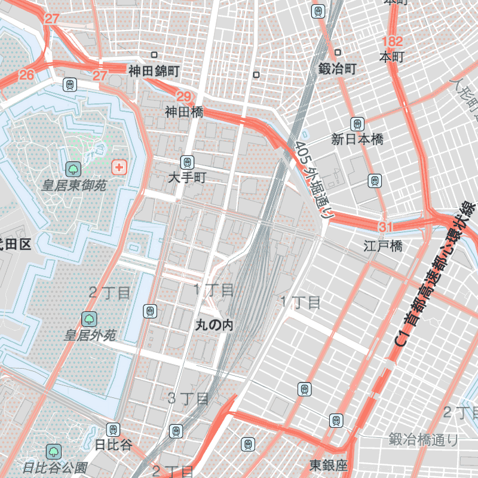
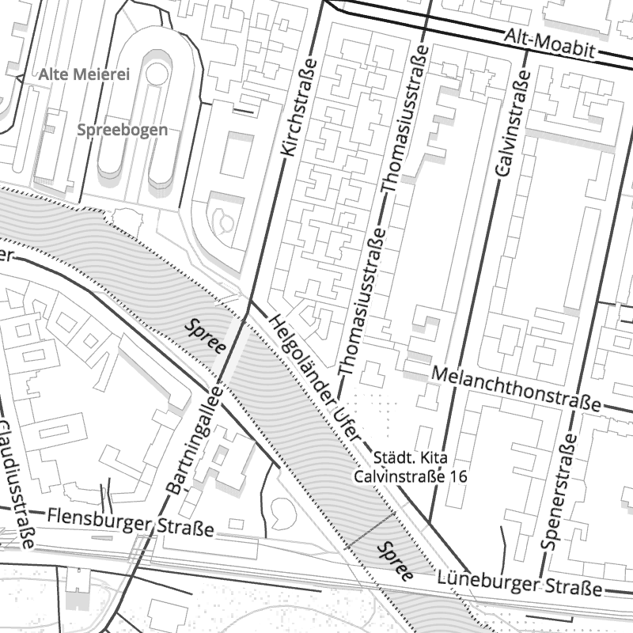
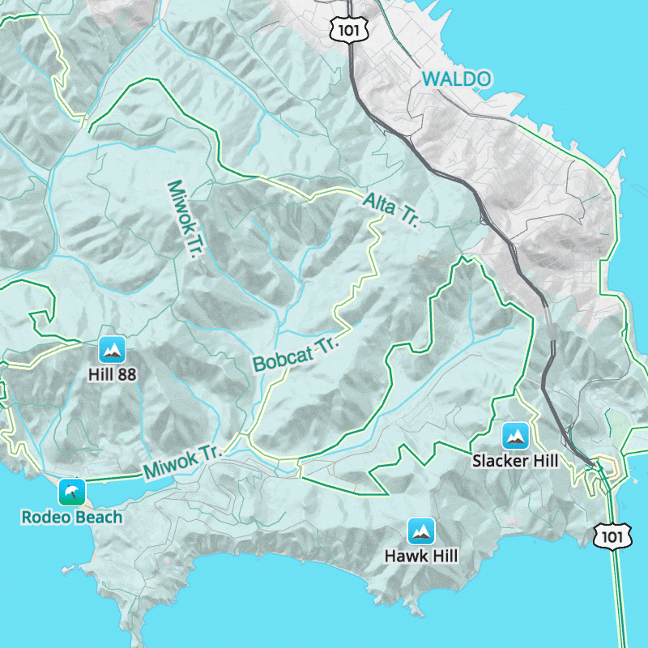
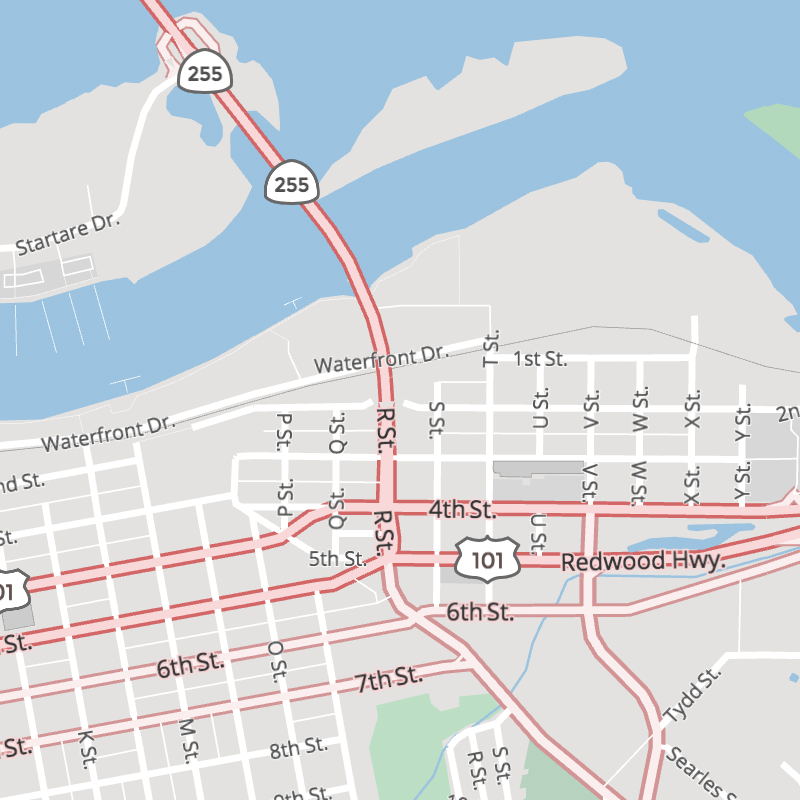

# Basemap styles

Use gorgeous 2D and 3D basemap styles created by Mapzen's expert cartographers for Tangram.

As Mapzen's basemap styles are still in active development, you should peg an import to a specific **MAJOR** version, such as `9`, so you enjoy any minor and patch updates but are ensured of stable named scene elements.

You should only peg to the **LATEST** version if you are not modifying documented API scene elements.

Because each style imports additional resources, we provide a scene bundle in `.zip` format which includes the scene yaml, image, font, and any other required imports.

### All of Mapzen basemap styles support:

* Set Mapzen API key
* Alter label language and density
* Customize basemap styling
* Mapzen icon library
* Data visualization overlays
* Transit overlay
* Default draw and user experience styles

### Some Mapzen basemap styles support:

* Bike overlay _(Walkabout)_
* Path overlay _(Walkabout)_
* Color themes _(Refill)_

## Bubble Wrap

A full-featured wayfinding style loaded with helpful icons for points of interest.

**View Bubble Wrap:** [default](https://mapzen.com/products/maps/bubble-wrap) | [more labels](https://mapzen.com/products/maps/bubble-wrap/more-labels) | [no labels](https://mapzen.com/products/maps/bubble-wrap/no-labels)

Current **MAJOR** release (includes any minor and patch updates):

* `https://mapzen.com/carto/bubble-wrap-style/8/bubble-wrap-style.zip`

**LATEST** (same assets as MAJOR version above):

* `https://mapzen.com/carto/bubble-wrap-style/bubble-wrap-style.zip`

## Refill

A minimalist map style designed for data visualization overlays. Inspired by the seminal Toner style by Stamen Design.

Refill is offered in a range of **color**, **label**, and **detail** [themes](themes.md), including the **Zinc** color theme which was earlier offered as a standalone basemap style.

**View Refill:** [default](https://mapzen.com/products/maps/refill) | [more labels](https://mapzen.com/products/maps/refill/more-labels) | [no labels](https://mapzen.com/products/maps/refill/no-labels)

Current **MAJOR** versioned release (includes any minor and patch updates):

* `https://mapzen.com/carto/refill-style/9/refill-style.zip`

**LATEST** (same assets as MAJOR version above):

* `https://mapzen.com/carto/refill-style/refill-style.zip`

## Walkabout

This outdoor style is perfect for hiking or getting out and about, with mountains, ski trails, biking paths, and transit stops.

**View Walkabout:** [default](https://mapzen.com/products/maps/walkabout) | [more labels](https://mapzen.com/products/maps/walkabout/more-labels) | [no labels](https://mapzen.com/products/maps/walkabout/no-labels)

Current **MAJOR** versioned release (includes any minor and patch updates):

* `https://mapzen.com/carto/walkabout-style/6/walkabout-style.zip`

**LATEST** (same assets as MAJOR version above):

* `https://mapzen.com/carto/walkabout-style/walkabout-style.zip`

## Tron

Will autonomous cars dream as they charge overnight? Mapzen is pushing mapping to new extremes with Tron, and it will push your GPU and fan to the limit.

**View Tron:** [default](https://mapzen.com/products/maps/tron) | [more labels](https://mapzen.com/products/maps/tron/more-labels) | [no labels](https://mapzen.com/products/maps/tron/no-labels)

Current **MAJOR** versioned release (includes any minor and patch updates):

* `https://mapzen.com/carto/tron-style/5/tron-style.zip`

**LATEST** (same assets as MAJOR version above):

* `https://mapzen.com/carto/tron-style/tron-style.zip`

## Cinnabar

A classic web map style for general mapping applications. Utiliarian, flat, daily workhorse.

**View Cinnabar:** [default](https://mapzen.com/products/maps/cinnabar) | [more labels](https://mapzen.com/products/maps/cinnabar/more-labels) | [no labels](https://mapzen.com/products/maps/cinnabar/no-labels)

Current **MAJOR** versioned release (includes any minor and patch updates):

* `https://mapzen.com/carto/cinnabar-style/8/cinnabar-style.zip`

**LATEST** (same assets as MAJOR version above):

* `https://mapzen.com/carto/cinnabar-style/cinnabar-style.zip`

## SDK Default

Design your own map but bring in Mapzen's UX and UI elements for search results and turn-by-turn navigation. 

Current **MAJOR** versioned release (includes any minor and patch updates):

* `https://mapzen.com/carto/sdk-default-style/1/sdk-default-style.zip`

**LATEST** (same assets as MAJOR version above):

* `https://mapzen.com/carto/sdk-default-style/sdk-default-style.zip`
