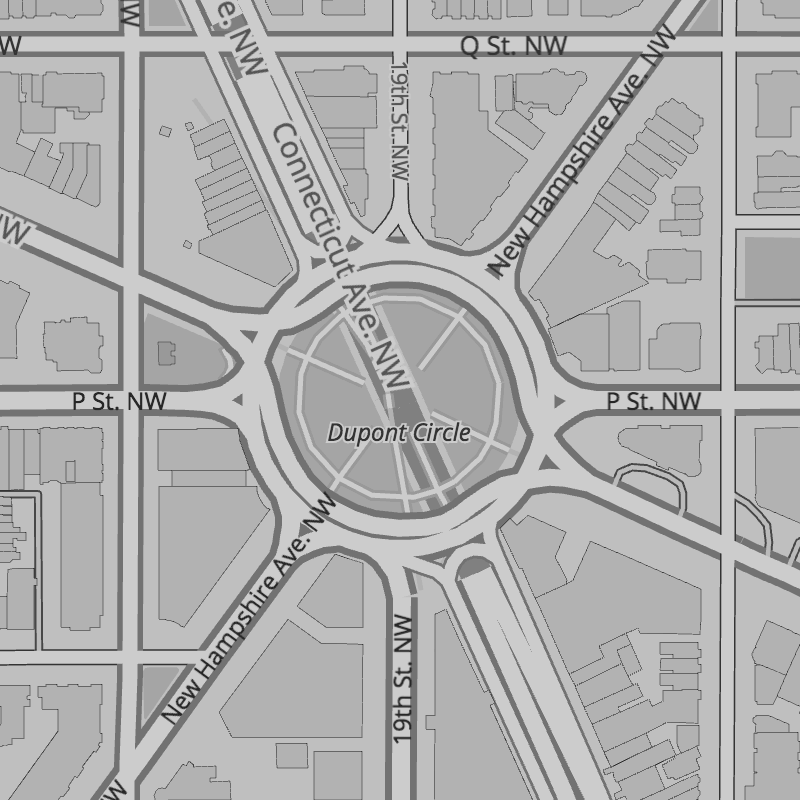

# Basemap Styles

Use gorgeous 2D and 3D basemap styles created by Mapzen's expert cartographers for Tangram.

As Mapzen's basemap styles are still in active development we recommend peggging an import to a specific **MAJOR** version, eg: `6`, so you enjoy any minor and patch updates but are ensured of stable named scene elements.

We only recommend pegging to the **LATEST** vesion if you are not modifying documented API scene elements.

Becuase each style imports additional resources, we provide a scene bundle in `.zip` format which includes the scene yaml, image, font, and any other required imports.

All of Mapzen basemap styles support:

* Set Mapzen API key
* Alter label language and density
* Customize basemap styling
* Data visualization overlays
* Transit overlay
* Default draw and user experience styles

Some Mapzen basemap styles support:

* Bike overlay _(Walkabout)_
* Path overlay _(Walkabout)_

## Bubble Wrap

A full-featured wayfinding style loaded with helpful icons for points of interest. See it
 in action in our very own [Eraser Map on Android](https://mapzen.com/blog/erasermap-beta/).

**View Bubble Wrap:** [default](https://mapzen.com/products/maps/bubble-wrap) | [more labels](https://mapzen.com/products/maps/bubble-wrap/more-labels) | [no labels](https://mapzen.com/products/maps/bubble-wrap/no-labels)

Current **MAJOR** release (includes any minor and patch updates):

* `https://mapzen.com/carto/bubble-wrap-style/7/bubble-wrap-style.zip`
* `https://mapzen.com/carto/bubble-wrap-style-more-labels/7/bubble-wrap-style-more-labels.zip`
* `https://mapzen.com/carto/bubble-wrap-style-no-labels/7/bubble-wrap-style-no-labels.zip`

**LATEST** (same assets as MAJOR version above):

* `https://mapzen.com/carto/bubble-wrap-style/bubble-wrap-style.zip`
* `https://mapzen.com/carto/bubble-wrap-style-more-labels/bubble-wrap-style-more-labels.zip`
* `https://mapzen.com/carto/bubble-wrap-style-no-labels/refbubble-wrapill-style-no-labels.zip`

_NOTE: Bubble Wrap adopted the standard default (some), more, and no labels configuration
 starting at version 6. Earlier versions of the default (1, 2, 3, 4, and 5) use the `more`
 labels configuration, and `no` labels assets are only available starting with version 6._

## Refill

A minimalist map style designed for data visualization overlays. Inspired by the seminal Toner style by Stamen Design.

**View Refill:** [default](https://mapzen.com/products/maps/refill) | [more labels](https://mapzen.com/products/maps/refill/more-labels) | [no labels](https://mapzen.com/products/maps/refill/no-labels)

Current **MAJOR** versioned release (includes any minor and patch updates):

* `https://mapzen.com/carto/refill-style/6/refill-style.zip`
* `https://mapzen.com/carto/refill-style-more-labels/6/refill-style-more-labels.zip`
* `https://mapzen.com/carto/refill-style-no-labels/6/refill-style-no-labels.zip`

**LATEST** (same assets as MAJOR version above):

* `https://mapzen.com/carto/refill-style/refill-style.zip`
* `https://mapzen.com/carto/refill-style-more-labels/refill-style-more-labels.zip`
* `https://mapzen.com/carto/refill-style-no-labels/refill-style-no-labels.zip`

## Walkabout

This outdoor style is perfect for hiking or getting out and about, with mountains, ski trails, biking paths, and transit stops.

**View Walkabout:** [default](https://mapzen.com/products/maps/walkabout) | [more labels](https://mapzen.com/products/maps/walkabout/more-labels) | [no labels](https://mapzen.com/products/maps/walkabout/no-labels)

Current **MAJOR** versioned release (includes any minor and patch updates):

* `https://mapzen.com/carto/walkabout-style/5/walkabout-style.zip`
* `https://mapzen.com/carto/walkabout-style-more-labels/5/walkabout-style-more-labels.zip`
* `https://mapzen.com/carto/walkabout-style-no-labels/5/walkabout-style-no-labels.zip`

**LATEST** (same assets as MAJOR version above):

* `https://mapzen.com/carto/walkabout-style/walkabout-style.zip`
* `https://mapzen.com/carto/walkabout-style-more-labels/walkabout-style-more-labels.zip`
* `https://mapzen.com/carto/walkabout-style-no-labels/walkabout-style-no-labels.zip`

## Tron

Will autonomous cars dream as they charge overnight? We’re pushing mapping to new extremes with Tron, and it will push your GPU and fan to the limit.

**View Tron:** [default](https://mapzen.com/products/maps/tron) | [more labels](https://mapzen.com/products/maps/tron/more-labels) | [no labels](https://mapzen.com/products/maps/tron/no-labels)

Current **MAJOR** versioned release (includes any minor and patch updates):

* `https://mapzen.com/carto/tron-style/3/tron-style.zip`
* `https://mapzen.com/carto/tron-style-more-labels/3/tron-style-more-labels.zip`
* `https://mapzen.com/carto/tron-style-no-labels/3/tron-style-no-labels.zip`

**LATEST** (same assets as MAJOR version above):

* `https://mapzen.com/carto/tron-style/tron-style.zip`
* `https://mapzen.com/carto/tron-style-more-labels/tron-style-more-labels.zip`
* `https://mapzen.com/carto/tron-style-no-labels/tron-style-no-labels.zip`

## Cinnabar

A classic web map style for general mapping applications.

**View Cinnabar:** [default](https://mapzen.com/products/maps/cinnabar) | [more labels](https://mapzen.com/products/maps/cinnabar/more-labels) | [no labels](https://mapzen.com/products/maps/cinnabar/no-labels)

Current **MAJOR** versioned release (includes any minor and patch updates):

* `https://mapzen.com/carto/cinnabar-style/6/cinnabar-style.zip`
* `https://mapzen.com/carto/cinnabar-style-more-labels/6/cinnabar-style-more-labels.zip`
* `https://mapzen.com/carto/cinnabar-style-no-labels/6/cinnabar-style-no-labels.zip`

**LATEST** (same assets as MAJOR version above):

* `https://mapzen.com/carto/cinnabar-style/cinnabar-style.zip`
* `https://mapzen.com/carto/cinnabar-style-more-labels/cinnabar-style-more-labels.zip`
* `https://mapzen.com/carto/cinnabar-style-no-labels/cinnabar-style-no-labels.zip`

## Zinc

A dark, minimalist style that helps bright data overlays stand out. A great alternative to Refill.

**View Zinc:** [default](https://mapzen.com/products/maps/zinc) | [more labels](https://mapzen.com/products/maps/zinc/more-labels) | [no labels](https://mapzen.com/products/maps/zinc/no-labels)

Current **MAJOR** versioned release (includes any minor and patch updates):

* `https://mapzen.com/carto/zinc-style/5/zinc-style.zip`
* `https://mapzen.com/carto/zinc-style-more-labels/5/zinc-style-more-labels.zip`
* `https://mapzen.com/carto/zinc-style-no-labels/5/zinc-style-no-labels.zip`

**LATEST** (same assets as MAJOR version above):

* `https://mapzen.com/carto/zinc-style/zinc-style.zip`
* `https://mapzen.com/carto/zinc-style-more-labels/zinc-style-more-labels.zip`
* `https://mapzen.com/carto/zinc-style-no-labels/zinc-style-no-labels.zip`
